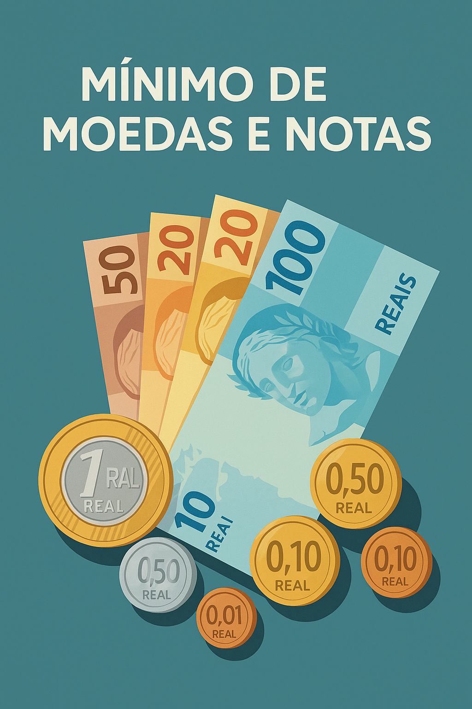

# Mínimo de Moedas e Notas

Este projeto em C# tem como objetivo calcular a menor quantidade de notas e moedas necessárias para representar um determinado valor monetário informado pelo usuário. Ele utiliza a linguagem C# com .NET Core 3.1 e é executado via console.

## 💡 Descrição

Dado um valor decimal (representando dinheiro), o programa imprime a quantidade mínima de notas e moedas necessárias para compor esse valor. É uma excelente introdução ao uso de operações matemáticas básicas e manipulação de números com ponto flutuante.

## 📂 Estrutura

- `Program.cs`: Contém a lógica principal de leitura do valor, cálculos de notas e moedas, e exibição do resultado.
- `.csproj`: Arquivo de configuração do projeto em .NET Core 3.1.

## 💻 Exemplo de uso

Entrada:
```
576.73
```

Saída:
```
NOTAS:
5 nota(s) de R$ 100.00
1 nota(s) de R$ 50.00
1 nota(s) de R$ 20.00
0 nota(s) de R$ 10.00
1 nota(s) de R$ 5.00
0 nota(s) de R$ 2.00
MOEDAS:
1 moeda(s) de R$ 1.00
1 moeda(s) de R$ 0.50
0 moeda(s) de R$ 0.25
2 moeda(s) de R$ 0.10
0 moeda(s) de R$ 0.05
3 moeda(s) de R$ 0.01
```

## 🛠️ Tecnologias

- C#
- .NET Core 3.1
- Visual Studio

## 📸 Ilustração


## 📄 Licença

Este projeto é apenas para fins educacionais e de prática. Sinta-se à vontade para usá-lo como base para seus estudos.

---

Desenvolvido por [Seu Nome]
